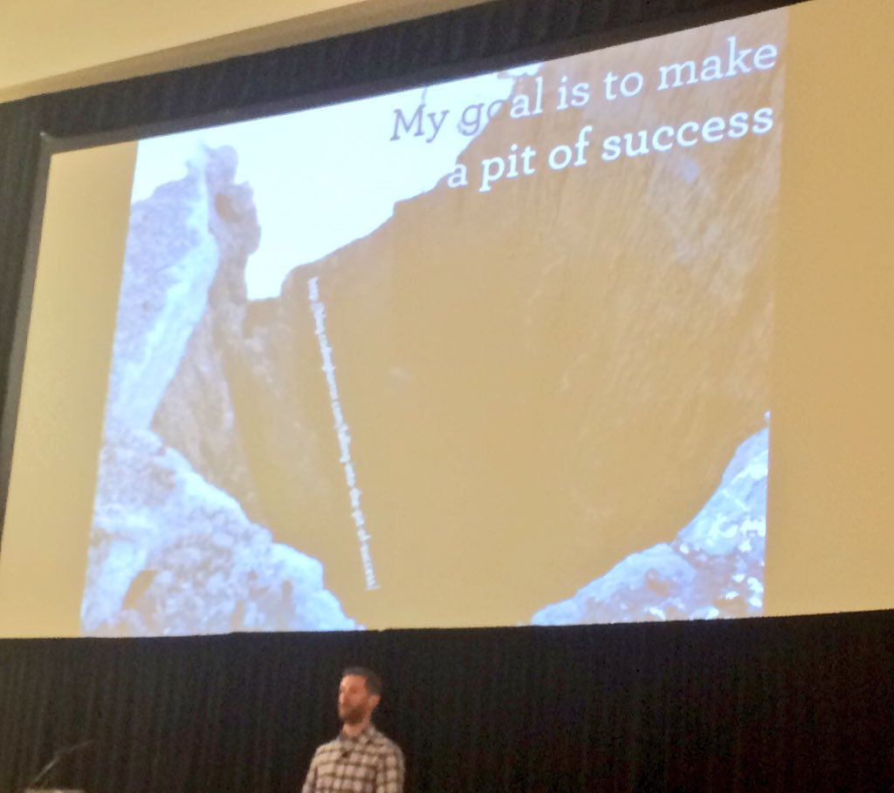

```{r setup, include=FALSE}
knitr::opts_chunk$set(echo = FALSE)
```

## Acknowledgements

- Anna Price and the TPP team who developed the actual content of this work
- *I just wrote some R code around it*

## Project Template

:::::: {.columns}
::: {.column width="50%"}
- Project template and R script template that aims to instil best practice
- Intended to be flexible
- https://github.com/Health-SocialCare-Scotland/phiproject
:::

::: {.column width="50%"}

:::
::::::

## R Script Template


## Why phiproject?

:::::: {.columns}
::: {.column width="50%"}
- Remove some of the *pain* of adopting best practice (particularly for beginners)
- Make it easier to follow a reproducible workflow
- Collaboration, portability, resilience
- Security
- Improve discoverability of R work/tools being developed in PHI
:::

::: {.column width="50%"}

:::
::::::

## The R code to create phiproject

Mostly very [simple](https://github.com/Health-SocialCare-Scotland/phiproject/blob/master/R/phiproject.R)

- `dir.create()`
- `writeLines()`
- [dcf file](https://github.com/Health-SocialCare-Scotland/phiproject/blob/master/inst/rstudio/templates/project/phiproject.dcf) to interact with RStudio

## Demo

1. Create new project with phiproject template
2. New features
3. RMarkdown templates
4. RStudio 1.2 vs RStudio < 1.2


## Planned Developments

Polishing up:

- Vignettes for RMarkdown templates
- Unit tests, code coverage, etc
- Continuous integration with Travis

Additional features/templates:

- ioslides template
- shiny template
- Leaflet template for making maps
- More stats templates
- Updating MS Word templates with [flextable](https://davidgohel.github.io/flextable)

## Contributing

This is an open-source project so all contributions welcome! e.g. documentation, issues, feature suggestions, [adding templates](https://github.com/Health-SocialCare-Scotland/phiproject#rmarkdown-templates)

- Clone the repo using git
- Create your own branch
- Add your input
- Push to Github
- Put in a pull request on git

For creatives, a hex logo might be nice!

## Package Updates
- Package hosted on Github and not CRAN
- R will not tell you about package updates
- RStudio Package Manager may help

## Thanks for listening

https://github.com/Health-SocialCare-Scotland/phiproject 
  
**Note**: *these slides were created in RMarkdown (requires Pandoc v2 which comes with RStudio 1.2)*  
https://bookdown.org/yihui/rmarkdown/powerpoint-presentation.html
